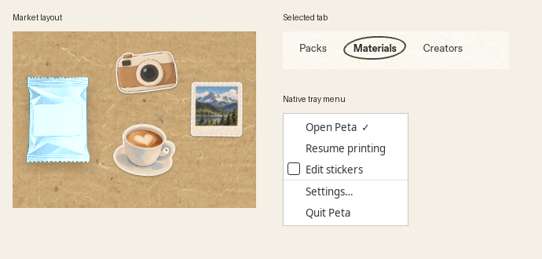

# Review 02 — 画像配置・ペンの丸・細いブラシ・最小のトレイ

今回のオーナー指示に合わせた変更。プロトタイプ／golden／素材ファイルは変更していません。オリジナル golden と異なる画像配置・選択表示は、今回指定された変更として比較できます。右側／after は本物の Tauri / WebKitGTK の画面で、Rust IPC と `/tmp` の QA ライブラリを使っています。

| 指摘 | 変更 |
|---|---|
| Market の画像が重なって読めない | 袋とカメラ・コーヒー・写真の3点を別々に配置。素材の加工なし、CSS と DOM の配置のみ。Pack の実際の内容8点は変更なし。 |
| Materials などの選択が分かりづらい | 太字と濃いペンの楕円。Market / Window style / Brush の共通 `.seg` に適用。選択状態は `aria-pressed`、キーボードのフォーカスも表示。 |
| Create のペンが太い | Size の最小値 8 → 1、既定 26 → 12、最大60。従来と同じ画像座標の半径。ズームしても編集座標・太さを保持。 |
| ストローク中に重い | 入力点を省略せずローカルキャンバスへ即時描画。ペンを離したら1回の Rust ストロークにまとめ、1回の Undo に対応。完成版の再描画は同時に1件まで。古い結果は破棄。Rust の描画入力を複製してロックを解放し、ストローク処理もワーカーへ移動。 |
| 上のメニューが多すぎる | Open Peta / Resume printing / Edit stickers / Settings… / Quit Peta の5項目。ページ一覧・Developer・ディスプレイ再同期はトレイから削除。印刷待ちがなければ Resume printing は無効。 |

## 画像

- `{studio,desk}-{market,settings,create}.jpg`: 修正前のネイティブ画面（e057ba2）／今回のネイティブ画面。
- `{studio,desk}-{market,settings,create}-golden.jpg`: 変更していない元 golden／今回のネイティブ画面。
- `*-before.png` / `*-after.png`: それぞれの1060×700ネイティブ画面を単独で保存。
- `materials-selected-native.png`: 実際に Materials を選んだ状態のデスクトップ全体。
- `tray-native.png`: **トレイに登録した同じネイティブ Menu インスタンス**を GTK のメニューとして表示。HTML の再現ではありません。ヘッドレス環境に常設のトレイホストがないため、開発用キャプチャコマンドで同じメニューをポップアップしています。macOS のメニューバー上の描画は未確認です。
- `details-native.png`: 上記ネイティブ画面から画像配置・選択丸・メニューを切り出して並べたもの。描き直しなし。

## 確認

- `controls.json`: 実ポインター入力で最小1のブラシを確認。ペンを離す前に画面のアルファが変化し、Rust へはまだストロークを送っていないことを確認。
- 曲線の入力点19点を保持。すばやく描いた2本をそれぞれ Undo / Redo でき、Rust の完成 PNG バイトが元通りになることを確認。Restore → Undo、3.48倍のズーム、ページ移動中／ウィンドウを閉じた途中の線の確定も確認。
- `tray-actions.json`: 本物のネイティブメニューをクリックして Open / Settings のページ移動、Edit チェック、Done によるチェック解除が通過。
- `audit.json`: 全8ページ × Studio / Desk × 1060×700 / 720×520 = 32状態。修正が必要な文字のはみ出し0。紙ボタンの元画像による既知の4px false positive は16件。
- Rust **84件**、JavaScript **13件**が通過。新しい Rust テストは描画入力の複製について、元の全解像度／プレビューの PNG と一致し、その後の編集に影響されないことを確認。ネイティブ debug build と JS 構文チェックも通過。

`performance-before.json` / `performance-after.json` は、実際の xdotool ポインター操作24回と、本物の Rust コマンドへの転送を記録した単発の測定です。描き始めの表示反映は **962ms → 7ms**、ストローク／再描画の IPC は **4 / 4 → 1 / 1**、同時処理の最大数は **4 → 1**。修正前の UI は入力を処理する間も描画で詰まるため、OS が一部のポインター移動をまとめています。修正後は曲線の別チェックで入力点の保持を確認済みです。既定のブラシも26→12に変わっており、同じ太さでの厳密なベンチマークではありません。数値は実行条件で変わります。

完成版は引き続き Rust で生成します。描画中の即時表示を完成版に置き換えるまでの待ち時間は残ります。今回の記録ではマウスを離してから確認用の待ち時間も含め約1.15秒（修正前は約1.40秒）。最大フレーム間隔も記録していますが、これはペンを離した後の完成版更新を含む値です。

再現: 前回 e057ba2 の debug binary で `python3 scripts/port-review-02.py before`、今回の binary で `python3 scripts/port-review-02.py after`。キャプチャ橋の設定は親 README を参照。その後 `python3 scripts/port-verify-review-02.py`、`python3 scripts/port-verify-tray.py`。プロファイラーは本物のコマンドをそのまま転送し、カウントのみ追加します。ネイティブメニューの検査／表示は debug build かつ `PETA_PORT_CAPTURE_DIR` 指定時のみ有効です。

Rust の差分は描画・トレイ UI・不要になったメニュー用の補助関数の削除のみ。日次回数、素材消費、Pack / Gift、保存・移行のルールは変更していません。
