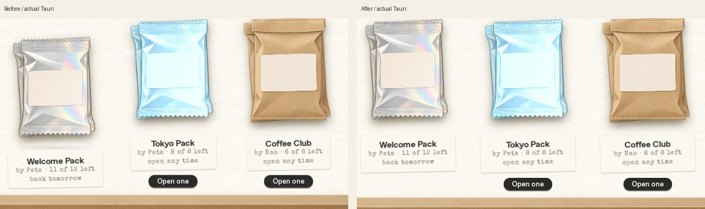
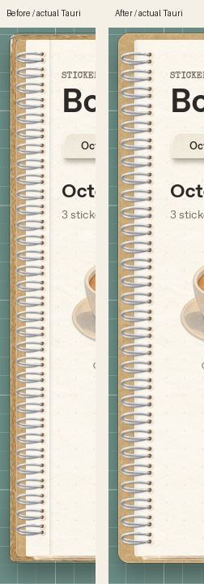

# Review 03 — Pack の高さ・窓内の開封・終了後の窓・ノート左端

今回のオーナー指示に合わせた修正。修正前は fa36ee7、修正後は本物の Tauri / WebKitGTK の画面。prototype・golden・納品画像は変更していない。README §7 の「開封後に窓が閉じる」と、以前のモニター全体へ広げる演出は、今回の指示で変更する。

| 指摘 | 修正 |
| --- | --- |
| Welcome の袋とラベルだけ位置が下がる | 袋224px・ラベル最小68px・操作24pxの共通行で整列。開封不可でも操作行の高さを確保し、ボタンは表示しない。Welcome の日次制限・在庫は変更しない。 |
| 開封がモニター全体になる | 開封時の setSize / setPosition と終了時の復元を削除。既存の窓内に演出を置き、角も窓の丸角でクリップする。袋・封筒・カード・ステッカーは実際のステージ寸法から縮小し、最小720×520でも操作できる。破る・引く・光・封蝋の順序、時間、イージングは維持。 |
| 終了すると窓が閉じる | Pack / Gift の Stick it・Later、Book の貼り付け、Create の Make 後もメインを残す。印刷レイヤーへの自動フォーカス移動を外クリックと区別する。赤丸 / Esc / 設定に従う実際の外クリックは従来どおり。 |
| ノート左端が不自然 | 紙の内側の縦線を物理的な左端へ戻す。額縁状になった cover-edge を外し、厚紙表紙は維持。リングを54px幅・21.09375pxピッチに戻し、上下キャップと中央帯を重ねず同じ位相で接続。穴は紙の中、リングは厚紙の左端に置く。 |

Today の素材カードは縮小後もホバーで位置を失わないよう、傾きに元の移動・拡大を加える。Keep の後の Today トレイへの移動と、Gift 保存後の Book 詳細も継続する。

## 画像

- `{studio,desk}-{packs,book}-{1060,720}.jpg`: 修正前／修正後の実ネイティブ画面8組。PNG は各単独画面。
- `*-1060-golden.jpg`: 変更していない golden／修正後の実画面4組。今回指定された整列・ノート左端の変更を比較できる。
- `pack-row.jpg` / `book-left-edge.jpg`: 上記ネイティブ画面の指摘箇所だけを切り出した比較。描き直しなし。
- `pack-*-pouch.png` / `pack-*-reveal.png` / `material-*-reveal.png` / `gift-*-reveal.png` / `gift-desk-720-sealing.png`: 実際に破る・引き抜く・封入する途中の窓内の画面。

## 検証

- `layout-before.json` / `layout-after.json`: 開封不可の Welcome と開封できる Tokyo / Coffee を同時に表示。修正前は袋・ラベルが33pxずれ、修正後は同じ行の袋・ラベル・操作位置が一致。最小サイズの折り返しも確認。
- `motion.json`: 実ポインターで Pack を横に破り、スリーブを引く。2シェル×2サイズ、Studio で Stick it / Desk で Later。各段階でネイティブ窓のサイズ・位置・可視状態を確認。Today と両シェルの Gift も最小サイズで開封し、素材ホバーで位置が戻ること、Today のトレイ、Create 完了後の空エディタ、実際の外クリックで閉じる設定まで9ケースが通過。
- `gift-file.json`: 最小サイズの Desk で実ネイティブ保存ダイアログ→窓内の封入→Book 詳細へ復帰。窓のサイズ・位置・可視状態が保たれ、完成 PNG のバイトが保存前と一致。実ファイル選択で読み込み、未開封の Gift として届く。
- `book-print.json`: Book 詳細の実際の Stick ボタンから再印刷。外クリック設定オンでもメインは残り、当日の Book 記録が Rust に保存される。
- `binding.json`: リサイズ前後・スクロール後のリング帯、キャップの非重複、穴の重複なし、紙の左端の影を確認。
- `overflow.json`: 8ページ×2シェル×2サイズの文字はみ出し検査。修正が必要なはみ出し0、紙ボタンの4px判定による既知の false positive のみ16件。
- Rust workspace 84件、JavaScript 14件、native debug build・変更JSの構文・Python構文・diff whitespaceチェックが通過。Rust変更は creator_finish の窓を隠すUI処理だけ。日次回数・素材消費・保存形式・FIFO・ルール移行に変更なし。

画像は独立した `/tmp/peta-review03-data`、操作は `/tmp/peta-review03-motion-data` の実 SQLite fixture。通常のユーザーデータには触れない。Linuxの書体・実データのタイトルや通知状態による golden との差は残る。画素単位の一致・macOS の描画やフォーカス挙動は未確認。[macOS確認項目](../../macos-checklist.md)に窓内開封と終了後の窓、印刷の自動フォーカスと手動外クリックを追加した。

再現: `scripts/port-fixture.py` で新しい `/tmp` のfixtureを作り、同じ XDG_DATA_HOME / XDG_CONFIG_HOME / XDG_CACHE_HOME を指定して実 debug binary を起動する。キャプチャ橋の設定は親 README を参照。修正前のbinaryで `python scripts/port-review-03.py before`、今回のbinaryで `python scripts/port-review-03.py after`。操作検査は **別の未開封fixture** を起動して `python scripts/port-verify-review-03.py`、続けて `python scripts/port-verify-review-03-gift.py`、`python scripts/port-verify-review-03-layout.py`。撮影・検査スクリプトは単一キャプチャIPCを使うため同時には実行しない。
