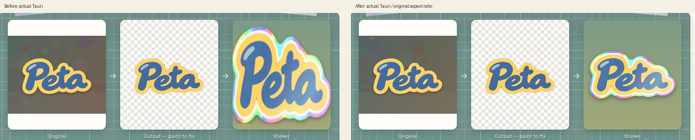

# Review 04 — Create 完成プレビューの歪み

原因はコピーした polish.css の `.stk-host .stk { height: 100% }`。縦横比を持つ div に枠の高さを指定し、子の img も100%高さで引き伸ばしていた。div への object-fit: contain には画像の比率を保つ効果がない。

修正前の実画面では完成 PNG は551×308（比率1.78896）、表示は230×227（比率1.01322）だった。生成されたPNGとRustヘッダーの寸法は一致し、保存前の画像生成から歪んでいたわけではない。

native.css でステッカーと img の高さを auto に戻す。Create は PNG の比率に従い、既存の最長辺230pxと枠の内寸の両方に収まる同じ倍率を計算する。既存の ResizeObserver で枠のサイズ変更にも追従する。光沢マスクは同じ比率のステッカーに重なる。Rust、画像素材、prototype、golden は変更していない。

- `studio-create.jpg`: 修正前 d7f1d60 / 修正後の全画面。`preview-ratio.jpg` はこのPNGから3枚のプレビューだけを切り出したもの。
- `{studio,desk}-create-golden.jpg`: 未変更の元golden / 実Tauri。goldenは猫のサンプル、今回の実画面は指摘に合わせた Peta! サンプル。
- `before.json`: 修正前の実PNG寸法、表示寸法、SHA256。
- `verification.json`: 横長Peta!・ほぼ正方形の花・縦長の写真を、両シェル×1060×700 / 720×520 / 1440×900 / 1060×700へ戻す操作で確認した24状態。全状態で実PNGとヘッダー寸法が一致し、ステッカー・img・光沢マスクの比率が一致、絵全体が枠の内側へ収まる。
- 修正前と後のPeta!サンプルは、完成PNGのSHA256が一致。生成結果は変更せず、表示を修正した。切抜きだけのホイールズームもリサイズ後に維持。
- `overflow.json`: Createの両シェル×1060×700 / 720×520、修正が必要な文字はみ出し0。紙ボタン画像の既知の4px判定のみ12件。
- native debug build、JS14件、変更JS/Python構文、diffチェックが通過。Rustの変更はないため、前回84件のRust検証に追加の変更はない。macOSの実機描画は未確認。

実データは専用 `/tmp/peta-review04-data` のSQLite fixture。Holographic解放済み・在庫1の状態で、実際の creator_begin_bytes / creator_render を呼んだ。素材を消費する Make は行わず、通常のユーザーデータにも触れない。

再現: 親READMEのdebugキャプチャ設定と `port-fixture.py` を使い、アプリ起動前に専用fixtureの material_stock の holographic count を1へ設定する。修正前の同じサンプルの before.json / studio-create-before.png を用意して `python scripts/port-verify-review-04.py`。同じレンダー設定（Outline20 / Smooth4 / Holographic）が必要。
