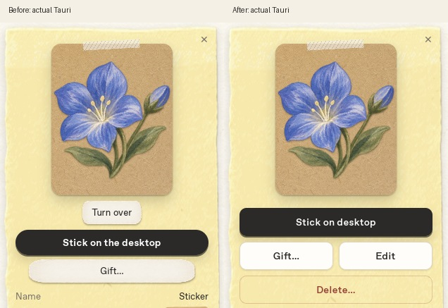

# Review 05 — Book の直接反転・オリジナルの再編集と削除

オーナー指定に従い、Turn overボタンを削除し、詳細のステッカー自体をクリックすると反転する。実buttonなのでTab・Space・Enterでも操作でき、表裏の状態と操作名をariaで通知する。貼る／剥がすを上段、GiftとEditを等幅の次段、Deleteを確認付きの下段へ配置。高さ40px・角10px・間隔8px・書体600/14pxを共通化し、Gift入力のCancel／Seal & saveと削除確認にも適用した。



「編集」はオーナー回答の **切り抜き・輪郭の再編集**。BookのEditから元写真と保存した切抜き・輪郭設定をCreateへ読み戻し、Save changesで同じステッカーを更新する。素材変更はなく、残数0でも再編集できる。番号・作成日・素材・配置・回転・印刷待ち順を保持し、素材消費・新規番号・印刷への自動追加はしない。Cancelは保存データを変更しない。Undo／Redoは今回の編集開始時まで戻す。保存後はBook・デスクトップ・既存の印刷待ち画像のキャッシュを更新する。

Delete…は詳細内に対象範囲を表示して確認し、確定した自作だけをBook・配置・印刷待ちから削除する。在庫や番号は戻さず、送信済みGiftコピーは変更しない。Pack／受取品にはEdit／Deleteを表示せず、Rust側でも拒否する。タイトル保存など既存TODO(owner)には手を付けていない。

## 保存と互換性

- 新規作成時と再編集保存時にeditor.jsonを保存し、解析マット・ブラシ修正・Outline／Smooth／Strengthを復元する。再開時のUndo基準は保存済み切抜き。
- 過去のオリジナルはeditor.jsonがないため、保存済みmask.pngを基準にする。過去の輪郭・Smoothの数値は保存されていなかったので、Outline20・Smooth0・Strength0.5から調整する。マスクもない古いデータは元画像から解析する。過去の設定の完全復元は主張しない。
- 更新は新しいrevisionディレクトリへPNG・mask・editorを書き終えてからDBの参照を切り替える。書込失敗なら以前の参照と画像を保持する。元画像と古いrevisionは削除まで保持する。スキーマv7・既存データの移行・日次ルールは変更しない。
- 削除はDBの外部キーで配置・履歴・印刷待ちを消去してから、自作の素材ディレクトリを掃除する。生成済みGiftファイルは独立した完成PNGを保持する。

## 実画面・検証記録

- `book-actions.jpg`: 修正前d0de0e3／修正後の実Studio詳細から操作部分を同じ座標で切り出した比較。
- `{studio,desk}-book-{1060,720}.jpg`: 両シェル・通常／最小サイズの修正前後4組。対応するbefore/after.pngはネイティブ画面。最小サイズは詳細まで実スクロールした状態。
- `{studio,desk}-book-1060-golden.jpg`: 未変更golden（猫・別月）／実アプリ（花・9月）。データの違い、今回指定された操作レイアウト、Linuxの書体は意図的に差がある。
- `layout-before.json`／`layout-after.json`: 実寸、書体、角、Turn over行の削除、直接反転の操作要素。全画面は通常どおり縦スクロール可能で、付箋の履歴まで到達できる。
- `studio-book-clicked-back.png`: 実マウスで反転した裏。`studio-original-editing.png`: 実作成したHolographic原本を再編集して輪郭を44へ変更した画面。`studio-delete-confirm.png`／`studio-book-gift-form.png`: 実確認とGift入力。`{studio,desk}-original-editing-720.png`: 最小サイズの既存原本編集。`{studio,desk}-original-controls-720.png`: 実スクロールでSave changesまで到達した状態。
- `verification.json`: 実マウスとSpace／Enterの反転、読込中キャンセル、旧原本編集のキャンセル、最後の素材を使った新規作成→配置→残数0で再編集→Erase→Undo／Redo→保存→同一PNGで再開→Cancel→削除確認のCancel→再印刷待ちと配置ごとの確定削除。再編集中も実際の再印刷待ちを残し、前後のDB値・FIFO順・デスクトップと印刷口の画像SHA256を記録。受取品のUI制限とバックエンド拒否、古いUI権限で削除を拒否された際のボタン復帰も検証。
- `states.json`: 詳細／Delete確認／Gift入力／編集 × 両シェル × 1060×700・720×520の16状態。ボタン40px・角10px・同行の等幅を検証。修正が必要な文字はみ出し0、既存紙ボタンの4px判定12件。
- `overflow.json`: 8ページ × 両シェル × 両サイズの32状態。修正が必要な文字はみ出し0、既存紙ボタンの4px判定4件。
- Rust workspace **89件**（既存84＋原本管理5）、JavaScript **14件**、native debug build、変更JS／Python構文、diffチェックが成功。追加Rustテストは保存状態の復元、ID・在庫・印刷順・配置・Giftコピーの保持と再起動、書込失敗、削除、対象制限を検証する。

実装は本物のTauri／WebKitGTKとRust IPC、専用/tmpのSQLite fixtureで確認。ユーザーの通常データ、prototype、golden、納品素材は変更していない。ネイティブ全画面比較はX11の実画面から窓の矩形を切り出し、初回のGPU描画が欠けたキャプチャを採用していない。操作検証はGPU有効／無効の環境でも実施したが、最終Book比較と16状態監査は通常の合成描画で行った。macOS固有の描画・フォーカス・Retina・複数画面の同期は未確認で、[実機チェックリスト](../../macos-checklist.md)へ追加した。

## 再現

親READMEのデバッグキャプチャ設定で実アプリを起動する。`port-fixture.py`で**新しい**専用/tmpライブラリを作り、起動前にholographicのmaterial_stock.countを1にする。`XDG_DATA_HOME`を同じ専用ライブラリに設定して次を順に実行する。検証はそのfixtureの最後の素材を消費し、作ったテスト原本を削除し、NaoのGiftを開く。

```sh
python scripts/port-review-05.py after
python scripts/port-verify-review-05.py
python scripts/port-review-05-states.py
```

撮影スクリプトはこのディレクトリのbefore.pngを使う。beforeは修正前d0de0e3で撮影済みで、撮り直す場合は同じfixture・シェル・サイズ・選択した花で`port-review-05.py before`を行う。キャプチャIPCはdebug版かつ明示的な環境変数がある場合だけ動く。
