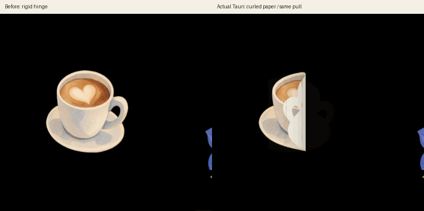
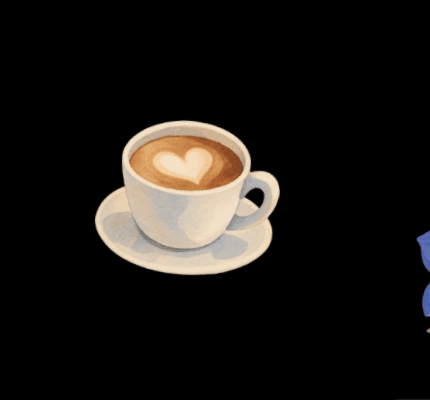

# Option剥がしの紙カール（2026-10-04）

対象は本物のTauriデスクトップ層。Option＋ドラッグで一枚の板を傾ける表示から、貼り付いた部分を残し、引いた側だけを巻き返す表示に変更した。輪郭と透明部分は保存済みPNGに従い、12枚の細い面で曲面を作り、既存の素材別裏紙を裏面に使う。半ピクセル弱の描画重なりで面の隙間を埋める。src/artの加工・追加、プロトタイプ・golden・Rust・DB/schema・O1〜O5の変更はない。



左は変更前の実Tauriデスクトップ、右は変更後の実Tauri/WebKitGTK層ウィンドウ。両方とも同じ/tmpライブラリのコーヒー、同じ配置・4°回転・60px右への引き量。430×400の同位置で切り出した実画面であり、紙の画像を加工したものではない。LinuxのX11透過窓ではroot合成が古いフレームを残すことがあったため、変更後は実レイヤー窓を直接撮影している。元のgoldenにはOption剥がしの途中状態がなく、元goldenは変更していない。



録画はxdotoolの実マウス／Alt入力で引き量を増やし、確定して外れる経路。図中の黒は透明窓を撮ったテスト環境の背景。GIFは検証資料としてループするが、アプリのカールは常時アニメーションではない。ドラッグのpointermoveだけで更新し、静止中は曲面へのstyle更新0。戻し240ms／確定360msのRAFは終わると止まり、紙片・陰影・clip-pathを破棄する。

## 判定・保存・設定

- 距離は既存どおり、長辺×0.45でprogress=1、0.8以上で離すと確定。追加の作成制限や在庫消費はない。途中解除は巻戻し、ポインタ中断／Escは貼付へ戻す。
- 貼付座標・倍率・回転はカールで変更しない。剥がしたものはBookに残る。成功したpeel_stickerにだけ触覚を1回、途中・戻し・Hapticsオフでは鳴らさない。
- Reduce motionでは曲面も戻し／離脱のRAFも作らず、同じ距離で確定する。操作中にオンへ切り替えた場合も曲面を除去する。通常の貼り直しバウンドも省略する。

## 検証

`peel.json`に実Tauri/Rust IPCの記録を残す。専用/tmpライブラリで、実Print貼付→Edit→Optionカール・途中解除・確定、3素材の裏紙、斜め／上への引き、ポインタ中断、Esc、操作中のReduce motion切替、成功時触覚1回、Book保持、在庫不変、静止中の曲面更新0、終了後のRAF停止を確認する。ポインタ中断だけはDOMのpointercancelを注入し、その他のドラッグは実マウス入力。トラックパッドの触感・macOSの透過と複数画面は実機チェックリスト§11へ残す。

純関数テストでは、平面と曲面の切出しが元の領域を欠落なく覆うこと、左右／上下／斜めと回転した絵での輪郭・方向、確定閾値前に裏紙が見えること、ゼロ／極端な引き量で有限値を保つことを検証する。

再現: 親READMEの実Tauriキャプチャ環境を使い、既存の/tmp fixtureにKraftの配置も加える。変更前の同じ60px引きのroot画像を `/tmp/peta-peel-before.png` に保存してから実行する。印刷待ちを1枚実際に貼り、ネイティブのEdit状態へ入るため待ちを用意する。この検証は2枚剥がすので通常データでは実行しない。

```sh
python3 scripts/port-verify-upgrades.py peel
npm test
npm run check:mac
```

Linux/OpenboxではAlt＋左ドラッグが窓移動へ横取りされないよう、テスト用WM設定でその操作だけSuperへ一時変更してから実行し、終了後に戻す。アプリの入力定義は変更しない。macOSでは通常のOptionで確認する。

結果: `npm test` **31件成功**、上記の実マウス／Rust IPCの全検査成功、Linux debugビルド・JS／Python構文・差分チェック成功。`npm run check:mac`は前回と同じApple SDKのないLinuxでC依存の生成だけを省略し、macOS Rustの型検査成功。macOSのリンク・実行・触感の検証ではない。Rustの機能・日次ルールは今回変更していない。

変更ファイル: `src/main.js`、`src/placement.js`、`src/style.css`、`tests/placement.test.mjs`、`scripts/port-verify-upgrades.py`、`README.md`、`docs/decisions.md`、`docs/port-spec/macos-checklist.md`、`docs/port-spec/compare/README.md`と、このフォルダの記録・PNG・GIF。
