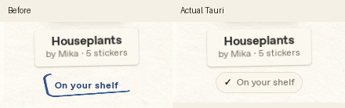

# Marketの購入済み表示と棚への移動（2026-10-04）

FeaturedのOn your shelfは、既存のMarket.getが所有済みなら何もせず戻るため、押してもMarketに留まっていた。詳細の同ボタンは無効化されていた。所有済みのFeatured／一覧／詳細はPacksへ移動し、該当する袋をスクロールして表示・フォーカスする。未購入は既存どおり詳細とGetを使い、無料デモ取得・有料購入の未提供・O1〜O5・DB v7は変えない。



青いスタンプ画像と字間を、チェック付きの小さい紙色ラベル（既存--paper／--muted／--inkとシステム書体）へ置換した。ui/stamp-owned.pngはnativeで使用終了としてart-adoption.mdへ記録し、画像自体は加工・追加していない。これはオーナー指定のgoldenからの意図した差分。prototype・goldenは変更していない。

比較は同じ1060×700、StudioのHouseplants欄。左は実Tauriの新しいラベル規則だけを一時的に外し、従来のpolish.cssのスタンプをそのまま描画したもの。撮影後に新規則を復元した。右は変更後の実画面。実Tauri/WebKitGTK主窓からラベル周辺を切り出したPNGで、参照画像から文字を作り直したものではない。両シェル・1060×700／720×520の実画面も `*-market-*.png`、一覧ラベルまでスクロールした画面は `*-owned-*.png` に置いた。

`market.json`は専用/tmpのSQLiteライブラリと実Rust IPC／実マウス入力の検査記録。Houseplantsを未取得状態から既存の無料Getで1回取得し、取得直後の詳細のOn your shelfから移動する。以後、両シェル・両サイズのFeaturedと一覧ラベルを押し、Packsの対象が見える・フォーカスする・残数不変・開封しないことを確認する。有料Pixel Dreamは既存どおり取得不可。通常／Reduce motionの移動も確認する。検査中のpack_install_demoは無料取得の1回だけで、pack_openは0回。

再現は親READMEのデバッグキャプチャ環境で新規/tmp fixtureを使う。Tokyo／Coffeeを所有済み、Houseplantsを未取得にする。比較用の一時スタイル解除／復元とキャプチャは検査スクリプトが行う。最小窓ではFeaturedのボタンまでスクロールしてから実クリックする。

```sh
python3 scripts/port-verify-upgrades.py market-owned
npm test
npm run check:mac
```

macOSのスクロール・キーボードフォーカスは実機チェックリスト§12へ残す。今回変更したコードはCSS／JSのみで、Rustのルール・スキーマ・画像素材・プロトタイプは変更していない。

検証結果: `npm test` 31件成功、JS構文・Python構文・Linuxの実Tauriビルド成功。上記の実マウス入力とEnterでの棚への移動はすべて成功（`market.json`）。`npm run check:mac` はLinux上でC依存のオブジェクト生成を省略したRust型検査のみ成功し、macOSのリンク・起動・実機検査は未実施。

`studio-market-golden.jpg`／`desk-market-golden.jpg` は変更していないgoldenと実画面を並べた比較。購入済み表示と棚への導線が今回の意図した変更。画像配置・書体の過去レビューでの修正と、fixtureの所有状態の違いも含むため、goldenとの全画面一致を示すものではない。
