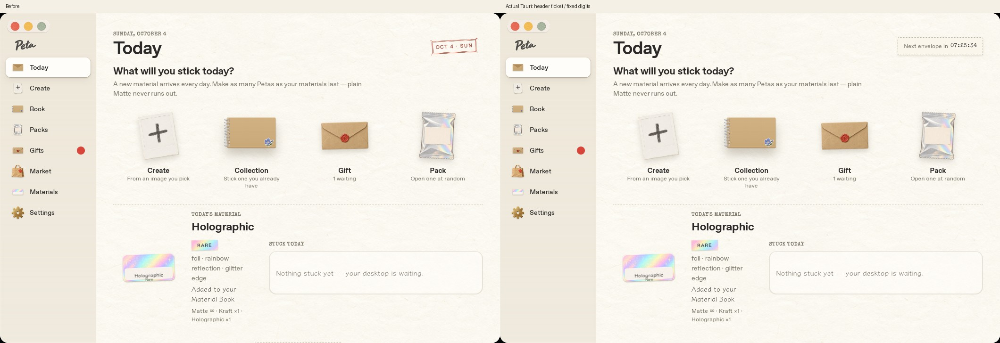

# 次の封筒の札の配置と固定幅（2026-10-04）

本文末尾の札を、開封後のToday見出し右側へ移した。従来の小さい日付スタンプに代わり、日付は左側の見出しに残る。Special Eliteは数字によって字幅が違うため、数字・コロンを固定幅の8枠へ収めた。書体・英語の文言・紙の表現は維持。

同じ/tmpライブラリ、実Tauri/WebKitGTKの変更前・変更後を撮影した。両シェル・1060×700／720×520の比較画像と、未変更のgoldenとの比較も同梱。goldenには札が無いので、その追加位置はオーナー依頼による差分。fixtureの素材・ステッカー状態と過去の修正も全画面比較に含む。

変更前は札だけでスクロール内容が73〜78px増えていた（`before.json`）。変更後は札を一時非表示にしても内容の高さが変わらず、札による追加は0px（`layout.json`）。通常サイズのStudioは縦スクロールなし。最小窓には元から2列の選択肢と素材欄があるため、本文自体のスクロールは残す。内容を隠したりスクロールを無効化したりはしない。

実画面で00:00:00／11:11:11／88:88:88／25:59:59へ変え、札・時計・各文字枠の幅が一致すること、見出しとの重なり・横はみ出しが無いことを検証。実時間で秒が進むこと、ページ離脱・主窓を隠したときのタイマー停止と復帰も確認する。

再現は親READMEのデバッグキャプチャ環境と、素材開封済みの専用/tmp fixtureを使う。変更前の同名キャプチャ4枚を置き、`python3 scripts/port-verify-upgrades.py countdown-layout` を実行する。JSの時刻処理・0時更新・Reduce motion・ルール・DB v7・画像素材・prototypeは変更していない。

`npm test` 31件、JS／Python構文・Linux実Tauriビルド成功。`npm run check:mac` はLinux上でC依存の生成を省略したRust型検査のみ成功。macOSのリンク・実行は未確認、実機チェックリスト§8 T5へ追記した。
