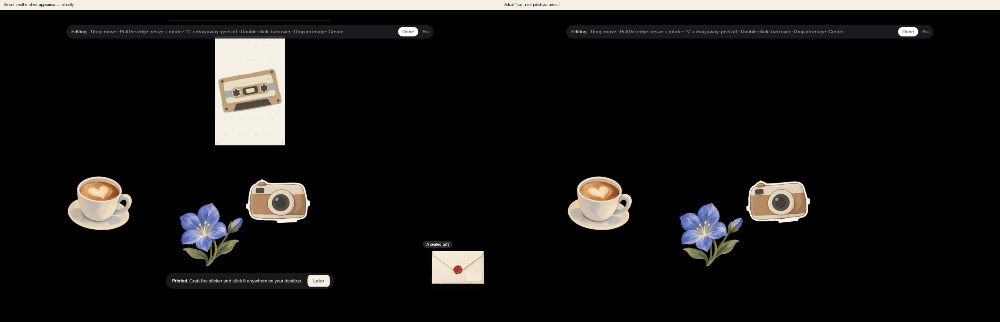

# 1枚貼った後の自動給紙を止める（2026-10-04）

貼付成功後の`print::sync`は、未処理の待ちがあれば印刷層を再開していた。そのため、1枚貼って編集しようとしている間に、別のステッカーが印刷口へ現れた。成功後は印刷層を停止し、貼った1枚のEdit Modeへ戻る。残りはDBの既存FIFOに保持し、Resume printingで続きを出せる。UIの配置・DB v7・スキーマ・素材消費・作成回数・Welcome制限は変更なし。

同じ専用/tmpライブラリのコピーで、既存の印刷待ちにBookから2枚を追加。実マウスで先頭を掴み、貼付した。変更前は次の紙が自動で出ることを再現（`before.json`）、変更後は紙が出ず、同じ次のIDがRustの`print_pending`に残ることを確認（`print.json`）。比較はLinux実Tauri／透明レイヤーの画面全体で、黒は空のXvfbデスクトップ。左下の印刷案内も停止する。Giftの到着表示は既存の状態／初期化の差を含む。

DoneとBookを開く操作で印刷を再開しないこと、明示的なResumeで同じ次の紙が出ること、Laterで待ちを消さないこと、済んだIDを再度貼付すると拒否し次の待ちを消費しないこと、素材残数不変を確認。FIFOの順序を入れ替える変更は含めないため、以前の待ちがあると新しくStickしたものより先に出る既存挙動は残る。

アプリを終了して同じ/tmpライブラリで再起動し、同じ次のIDが残ることも実IPCで確認した。起動・日付更新での既存の再開処理は変更していない。

検証: `npm test` 31件、coreのRustテスト84件＋描画統合5件、Linux実Tauriビルド成功。`npm run check:mac` はLinuxでC依存生成を省略したRust型検査のみ成功。macOS実機は未確認、チェックリスト§13へ追加した。

再現はキャプチャ環境と専用/tmp fixtureを使い、変更前の`print-before.png`を置いて`python3 scripts/port-verify-upgrades.py print-pause`を実行する。元のfixtureには実際のPack開封による印刷待ちがあり、検査でBookの2枚を後ろへ追加する。ルール修正はカウントダウンUIのコミットと分けた。
