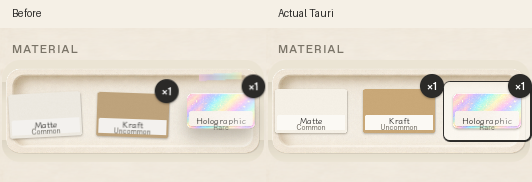

# 素材選択とホバーの安定化（2026-10-04）

選択時に上へ出る線は、素材カードに追加していた`creator/tape-1.png`。CSSの持ち上げとJSの3D傾きが同じボタンへtransformを書き、選択時に全ボタンを作り直していた。テープと両方の移動を除き、選択は固定したカードの枠で示す。属性だけを更新し、DOM・フォーカス・押せる範囲を保持する。

他のホバーも確認し、Materials・Packsの反射は移動しない操作面から座標を取る。Materials・Create見本・画像ドロップ・Giftの親の移動と、Pack／GiftのCTAの別の上下移動を除いた。装飾だけが反応するため、カーソルの下から操作面が逃げない。Createはプレビューを描き直すたびに追従ハンドラーを増やしていたため、固定したframeへ1回だけ登録し、現在のステッカーへ反射を適用する。

同じ専用/tmpライブラリ・実Tauri/WebKitGTKの画像を同梱。両シェル・1060×700／720×520で実マウスを四隅・中央へ移し、素材ボタンの座標・幅・transformが一致すること、5回切替後もDOM・フォーカス・選択1つ・プレビュー素材が一致することを検証。Materials／Packs／Gift／Market／ドロップ／見本の操作面も同じ検査を実施（`hover.json`）。

Createの現在のframeにpointermoveハンドラーが1つだけ、同じ場所へ戻すと同じ傾きとなることを確認。Reduce motionで追従と見本の移動を止め、素材残数・印刷開始・Pack／Gift開封の呼び出しが無いことも確認。素材選択・操作方法・消費のルール、DB v7、src/art、prototype、goldenは変更していない。golden比較は選択テープの除去と枠が意図した差分で、過去のブラシ／縦横比修正・fixtureの3素材と見本画像の違いも含む。

右下は`resize-h`の画像・色・疑似要素がすべて透明／noneであることを実画面の計算スタイルで確認した。角は丸く、外側はTauriの透過窓から背景が見える。今回この角の形は変更していない。macOSのWKWebViewで余分な描画が残るかは実機項目として残す。

`npm test` 31件、JS／Python構文・Linux実Tauriビルド成功。`npm run check:mac`はLinuxでC依存生成を省略したRust型検査のみ成功。macOSのリンク・実機未確認、チェックリスト§14へ追記した。新しいタイマー・RAF・常時アニメーションは追加していない。

再現は親READMEのキャプチャ環境と、Matte／Kraft／Holographicの在庫がある専用/tmp fixtureで`python3 scripts/port-verify-upgrades.py hover`。既存のBubble見本から実RustのCreatorセッションを作り、Makeは押さず、最後にCancelする。比較生成には変更前の`material-before.png`が必要。
