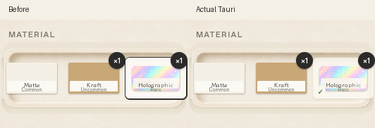

# 素材選択の黒枠を除去（2026-10-04）

選択中の素材を囲む濃い枠を除き、薄い紙色の台座・控えめな影・左下の小さなチェックに変更した。カード・名前・在庫の配置とサイズは変更せず、ホバー／選択でも操作面を動かさない。キーボード操作時のフォーカス輪郭は残し、選択状態は既存の`aria-checked`でも伝える。

Studio／Deskの1060×700と720×520を実Tauri・WebKitGTKで確認。各サイズで実マウスをカードの四隅・中央へ移動して位置不変、5回の素材切替でDOM・フォーカス・選択1つ・プレビュー素材の一致を検証した。Materials／Packs／Gift／Market／画像ドロップ／見本の操作面の安定性、Reduce motion、Createの追従ハンドラー1つ、素材残数不変・印刷／開封コマンドなしも再確認（`hover.json`）。

golden比較は`{studio,desk}-create-golden.jpg`。今回の意図した差は選択時の黒枠を除いた台座・チェックだけ。過去のテープ廃止・ブラシ／縦横比修正、fixtureの3素材・見本画像と実Rust描画、Linuxの書体差も画像に含む。golden・prototype・src/art・Rustのルール・DB v7は変更していない。

`npm test`は31件成功。Linux実Tauriビルド成功。`npm run check:mac`はLinuxでC依存生成を省略したRust型検査のみ成功し、macOSのリンク・実機は未確認。macOSチェックリスト§14 H1へ新しい選択表示を反映した。タイマー・RAF・常時アニメーションの追加なし。

再現は親READMEの専用/tmpキャプチャ環境で`python3 scripts/port-verify-upgrades.py hover review-11`。比較用の変更前画像は本ディレクトリの`material-before.png`。既存のreview-10は上書きしない。
