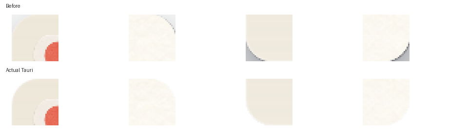

# ネイティブ窓の四隅の尖り（2026-10-04）

紙のフレームは丸かったが、外側のCSSシャドウが透明な角へ描かれ、ネイティブWebViewの四角い境界で切られて灰色の三角形になっていた。`native.css`でbodyの描画全体を既存のStudio 18px／Desk 20pxの外周にクリップした。ページ・ナビゲーション・開封画面と影が同じ丸い外周に収まる。窓自体は既存の透過・OS影なしの設定を使用する。

実Tauri・WebKitGTKをX11コンポジタ（xcompmgr、追加の影なし）と白い背景で撮影した。変更前の角に灰色の影があり、変更後は各角の最外ピクセルが背景と同じRGB(255,255,255)。白い矩形を重ねて画像を修正したものではない。`studio-before.png`は同じコンポジタ上の変更前の実画面。

`corners.json`には両シェル×1060×700／720×520の結果を保存した。各条件で全8ページの四隅が操作領域の外にあること、上端の移動領域と右下のリサイズ領域が残ることを確認。Todayと未開封Giftの開封画面を撮影し、Escで戻れることも確認した。Studioでは実マウスの右下ドラッグにより1060×700→1090×720へリサイズでき、素材残数も不変だった。撮影で封蝋は割っていない。

goldenとの比較は`studio-today-golden.jpg`／`desk-today-golden.jpg`。今回の差は四隅の描画クリップのみ。Todayの札・Bookナビゲーション・素材等は過去の修正を含み、fixtureの履歴・在庫・見本とLinux書体もgoldenと異なる。golden・prototype・src/art・Rustのルール・DB v7は変更していない。

`npm test`は31件成功、Linux実Tauriビルド成功。`npm run check:mac`はLinuxでC依存生成を省略したRust型検査のみ成功。macOSのリンク・実機描画は未確認で、macOSチェックリストW1に明暗背景・Retina・最大化を含む確認項目を追記した。常時アニメーション・タイマーの追加なし。

再撮影は親READMEの専用/tmpデータ・デバッグキャプチャ環境を使用する。透明部分の検証にはコンポジタが必要で、ネイティブ窓単独の画像ではなくデスクトップ全体を撮影して窓の矩形を切り出す。各シェル・サイズで`document.elementFromPoint`の四隅がbodyの外、`(innerWidth-12,innerHeight-12)`が`resize-h`、`(innerWidth/2,4)`が`titlebar`であることも検査する。通常ページとGiftの封蝋を割る前の画面を比較し、開封・消費は行わない。
