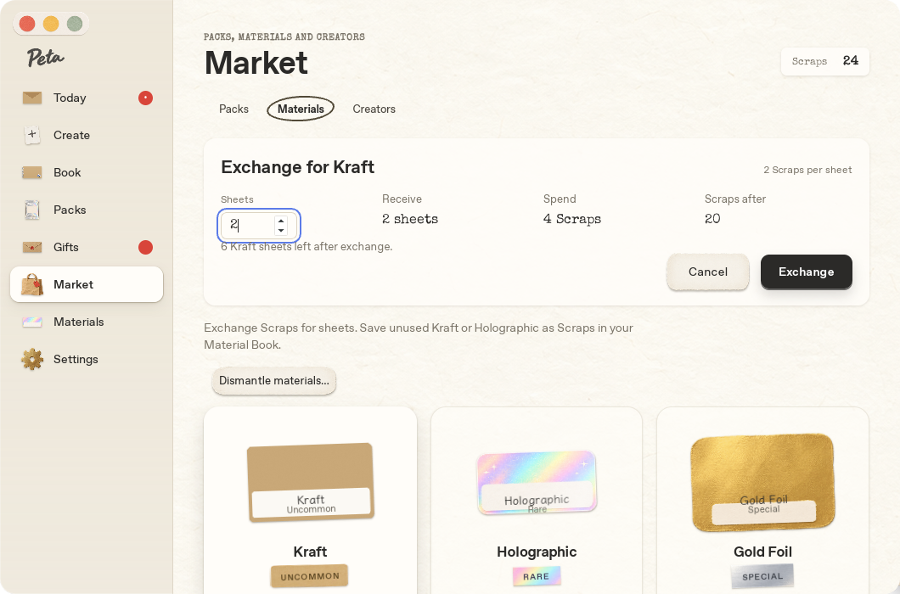

# Scrapsの分解・引換／Materialsのプレビュー（2026-10-04）

MarketとMaterialsの見出し右上に、RustのScraps残高を表示する。Materialsはカードのプレビューと分解だけにし、Createの素材選択・Create will use通知・黒い選択枠を除去した。素材カードとDismantleボタンは別の操作面で、親とボタンのホバー移動を重ねない。

分解・素材引換・空袋補充は同じ確認欄を使う。数量、受取数、引換の合計消費Scraps、操作後の残高を示し、確定前は消費しない。表示時にページ先頭へ戻すため、最小サイズでも見出し・残高・窓ボタン・操作欄が重ならない。エラーは再描画後も残り、Retryは同じリクエストIDで再確認する。在庫を全て分解した後に応答だけを失った場合も、数量を変えず再送できる。



比率・対象は既存P2の推奨案を初期仕様として採用した（個別の比率指定はなかったため作業中に明示）。Kraft分解+1／Holographic分解+3、素材1枚の引換は2／6。Tokyo／Coffee／Houseplantsの空袋は16／12／10で8／6／5枚補充。初回無料取得を維持し、中身のある袋・Welcome・有料Pack・未実装素材は対象外。PacksのMarket袋は残数と累計総数を表示し、開封済み項目を上書きしない。O3の現金決済・新素材、他の未決事項は実装しない。

RustのルールはUIと別コミット。既存DB v7のmetaに残高と取引結果を保存し、在庫・素材発見・袋の補充・残高・結果を1つのトランザクションで更新する。新テーブル・移行・画像素材の追加変更はない。Matte無制限、Welcome 1日1回、Market／Giftの開封回数、FIFOは維持する。瓶と切れ端の正式画像は制作の確認待ちで、今回は紙色の小さな残高ラベルを使う。

## 検証

- Rust core 93件＋描画・原本管理の統合5件成功。分解／素材取得／空袋補充、在庫不足・残高不足・不正数量・未提供商品の拒否、同じIDの再送と同時再送、別内容でのID再利用拒否、取引結果保存の失敗時の全更新巻き戻し、発見日保持、再起動、schema／user_version v7不変を検証した。
- npm testは31件成功。Linux実Tauriビルド成功。npm run check:macはLinuxでC依存生成を省略したRust型検査のみ成功。macOSのリンク・実行は未確認で、実機チェックリスト§15へ追記した。
- 実Tauri／WebKitGTK、Studio／Deskの1060×700／720×520の38状態で素材帳・プレビュー・分解確認・Market・素材引換確認・補充確認・補充後の棚を確認した。プロトタイプの文字はみ出しスキャナを使い、既存紙ボタンの4pxの装飾以外は0。生の結果はscraps.jsonに保存した。
- 実マウスのクリック、数量変更、キャンセル／Esc、在庫不足の無効表示、連打、分解・引換の応答だけを失わせてからのRetry、残高／在庫／累計袋数の同期、On your shelfでの移動、印刷待ち不変を検証した。実プロセスを再起動し、残高・在庫・補充履歴が保持され、同じ補充IDの再送で増えないこととDB v7を確認した。

Golden比較は{studio,desk}-{materials,market}-golden.jpg。今回の意図した差は残高、プレビュー／分解操作、引換可能な2素材と確認欄。元のMarketは未提供3素材の購入プレビューなので商品数と配置も変わる。狭いStudioでは見出し上に12pxを確保し、窓ボタンとの重なりを解消した。過去の書体・選択表示の修正、fixtureの在庫・履歴、Linux書体差も含む。golden／prototype／src/artは変更していない。

## 再現

親READMEのキャプチャ環境で、新しい専用/tmpデータにfixtureを作る。以下の在庫と空袋は検証用の初期条件で、実アプリがユーザーへ配布するものではない。

```sh
python3 scripts/port-fixture.py /tmp/peta-scraps-review13-data/app.peta.desktop
python3 - <<'PY'
import sqlite3
conn = sqlite3.connect('/tmp/peta-scraps-review13-data/app.peta.desktop/peta.db')
conn.execute("UPDATE material_stock SET count=4 WHERE material_id='kraft'")
conn.execute("UPDATE material_stock SET count=8 WHERE material_id='holographic'")
conn.execute("UPDATE pack_items SET opened_at='2026-10-03T12:00:00Z',sticker_id='PETA-PORT-0008' WHERE pack_id='tokyo'")
conn.commit()
conn.close()
PY
```

このディレクトリをXDG_DATA_HOMEにしてデバッグアプリを起動し、`python3 scripts/port-verify-upgrades.py scraps`。同じデータで実プロセスを再起動して`python3 scripts/port-verify-upgrades.py scraps-restart`。初期条件と単一キャプチャIPCが前提のため他の検証を同時に実行しない。常時タイマー・RAF・アニメーションの追加なし。
