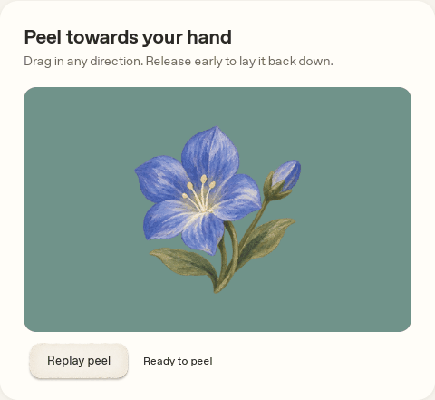
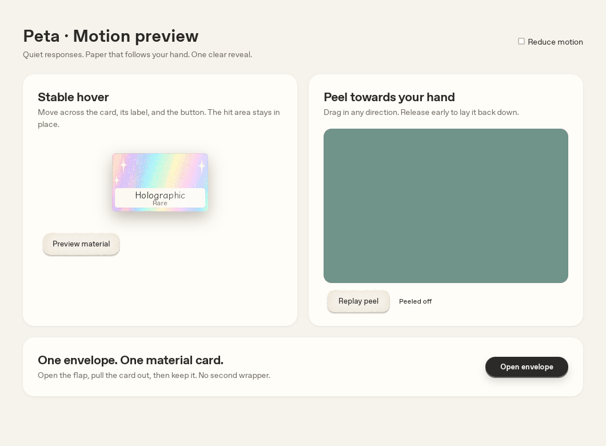

# 操作の完成度レビュー（2026-10-05）

実アプリの操作面を固定し、動く絵と内側のボタンの競合を解消。Option剥がしは手の方向へ折り返す連続した裏面にした。Todayの素材は封筒から1度だけ出る。

## プレビュー

`docs/ui-proposals/motion-polish-preview.html` は実アプリと同じ `core.js` / `sticker.js` / `ceremony.js` / `peel.js` を使う独立したプレビュー。ホバー、全方向のドラッグ、途中解除、開封、Enter／Space、Reduce motionを操作できる。素材の付与や印刷はしない。

リポジトリで `python3 -m http.server 8765` を実行し、`http://localhost:8765/docs/ui-proposals/motion-polish-preview.html` を開く（ES modulesを使うためHTTP経由）。

## 実Tauriの検証

- `peel.json`: 実マウスのPrint貼付 → Option剥がし。3素材、回転／斜め方向、途中復帰、確定、pointercancel、Esc、Reduce motion、触覚成功時1回、在庫不変、Collection保持、静止中の更新0、終了後RAF停止。窓マネージャのAlt＋左ボタンの「窓移動」をテスト用Xvfbで一時無効化した。macOSの操作設定は変えていない。
- `peel-comparison.png`: review-06の実Tauri画像と、同じ60px引きの現在の画像。黒い背景は透過レイヤーをX11で直接取得したもの。左右でめくれる端が変わり、別々の3D面の継ぎ目はなくなる。座標・在庫・確定距離は変更しない。
- `ui-verification.json`: 両シェル・720×520／1060×700のカードとヒント／情報欄の間隔、リサイズ、主要ページの固定操作面とホバー後のRAF停止。実際のToday開封では連打してもdaily_open_materialが1回、Holographicが0→1、Keep後も1。最後のフォーカス復帰修正前に実行したこの日次付与の検証を保存し、その後のリプレイは素材を付与しない。
- `*-final*.png`: 実Tauri。最小窓でもカードがヒント／Keepと重ならない。旧goldenの袋と光線は新しい開封順序で意図的に廃止。goldenや元のプロトタイプは更新していない。

`npm test`（44件）、`npm run check:mac`、`npm run check:mac:developer` を確認する。Mac向けcheckはLinux上のC／Objective-C依存スタブでの型検査で、Macのリンク／release bundle／実行ではない。実機の描画速度・Retina・触覚・透過・複数画面はmacos-checklist §20。

再現用の `scripts/port-verify-upgrades.py peel` は `/tmp` の専用fixtureだけで実行する。2枚剥がすため通常のデータに向けない。JSの新しい純関数テストは折り返す向きと回転、紙の面積・輪郭、復帰、追従停止を検証する。
