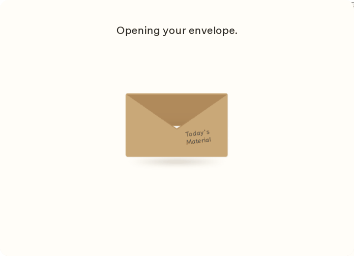

# 素材の結果を取り出すまで隠す（2026-10-05）

引き出す前は全素材共通の白紙を見せ、素材の柄・名前・レア度・読み上げ用の名前は、取り出しが確定した時点で初めて表示する。途中解除では白紙のまま戻る。開封直後にカードが最前面へ出る問題は、封筒内の3D重なりを平面へ固定し、固定したカード入れを封筒の口の形に切り取って解消した。ドラッグ開始でカードを前面へ上げない。

- `opening-flap.png`: フラップが開く途中。カードが封筒の前面を突き抜けない。
- `blank-card-peek.png`: 引く前の白紙。素材を特定できる名前・色・レア度はない。
- `material-revealed.png`: 取り出し確定後。従来の素材カード・情報・Keep it。
- `verification.json`: Linuxの実Tauri／WebKitGTK、720×520。両シェル×Matte／Kraft／Holographic×通常／Reduce motionの12通り。最初・待機・実マウスで短く引く・途中解除・Enterの連打・Keepの連打を確認。途中ドラッグでtransformが変わり、結果と重なり順は変わらない。結果のカードと情報欄は1つずつ、ヒント／Keepと重ならない。

検証は専用の`/tmp`データでの表示リプレイ。Cerは素材を付与しないため在庫が不変なことを確認した。Todayの付与処理とRust、DB、画像素材、Pack／Giftの受取処理は変更していない。GIFは実Tauriの開封途中から抽出し、overlayのフェード前の背景だけのフレームを省いている。

`npm test` 44件成功、通常版・Developer版のMac向け型検査とLinux debug build成功。Mac向け検査はLinuxのC／Objective-C依存スタブを使用し、Macのリンク・実行ではない。macOSのWebKit／Retina／VoiceOverは実機チェックリストM6で確認する。

操作プレビューはreview-16と同じ`docs/ui-proposals/motion-polish-preview.html`（実アプリの開封コードを共有）。リポジトリで`python3 -m http.server 8765`を実行し、`http://localhost:8765/docs/ui-proposals/motion-polish-preview.html`を開く。
